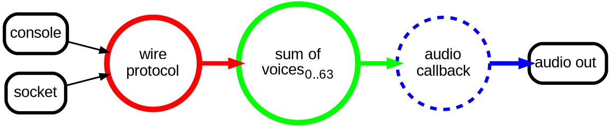

```graphviz
digraph g {
    rankdir=LR
    
    node [margin=0.07 fontname="Arial", fixedsize=false, penwidth=3]
    edge [penwidth=1.5; arrowsize=.75; minlen=1.99]

    console [shape=box, style=rounded]
    socket [shape=box, style=rounded]

    wp [label=<wire<br/>protocol>, shape=circle, color=red, penwidth=5]

    voice [label=<sum of<br/>voices<sub>0..63</sub>>, shape=circle, color=green, penwidth=5]

    ma [label=<audio<br/>callback>, shape=circle, style=dashed, color=blue]

    out [label=<audio out >, shape=box, style=rounded]

    console -> wp
    socket -> wp

    wp -> voice [color=red, penwidth=4]

    voice -> ma [color=green, penwidth=4]
    ma -> out [color=blue, penwidth=4]
}
```
