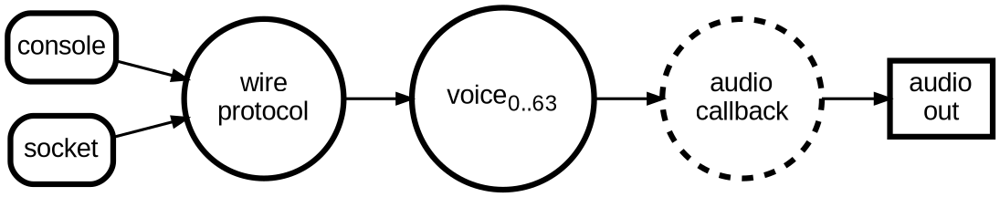

```graphviz
digraph g {
    rankdir=LR
    
    node [margin=0.07 fontname="Arial", fixedsize=false, penwidth=3]
    edge [penwidth=1.5; arrowsize=.75; minlen=1.99]

    console [shape=box, style=rounded]
    socket [shape=box, style=rounded]

    wp [label=<wire<br/>protocol>, shape=circle]

    voice [label=<voice<sub>0..63</sub>>, shape=circle]

    ma [label=<audio<br/>callback>, shape=circle, style=dashed]

    out [label=<audio<br/>out>, shape=box]

    console -> wp
    socket -> wp

    wp -> voice

    voice -> ma
    ma -> out
}
```
