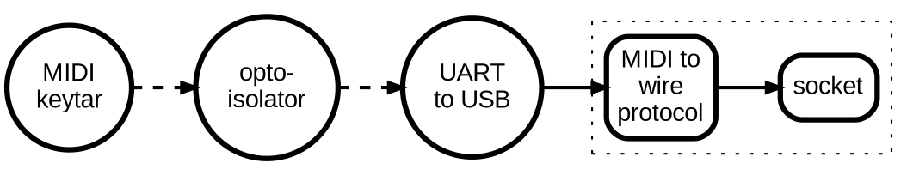

```graphviz
digraph g {
    rankdir=LR
    
    node [margin=0.09 fontname="Arial", fixedsize=false, penwidth=3]
    edge [penwidth=2; arrowsize=.75; minlen=1.99]

    keytar [/* penwidth=6, */ label=<MIDI<br/>keytar>, shape=circle]

    opto [label=<opto-<br/>isolator> shape=circle]
    uart [label=<UART<br/>to USB> shape=circle]

    subgraph cluster_0 {
        style=dotted;
        miracle [label=<MIDI to<br/>wire<br/>protocol> shape=box, style=rounded];
        socket [label=<socket> shape=box, style=rounded];
    }

    // hideme [style=invisible];

    keytar -> opto -> uart [style=dashed];
    uart -> miracle -> socket;
    // socket -> hideme [minlen=1.5, color=red; penwidth=4];
}
```
