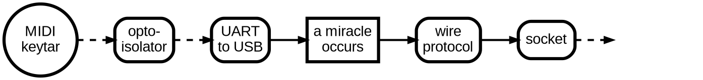

```graphviz
digraph g {
    rankdir=LR
    
    node [margin=0.09 fontname="Arial", fixedsize=false, penwidth=3]
    edge [penwidth=2; arrowsize=.75; minlen=1.99]

    keytar [/* penwidth=6, */ label=<MIDI<br/>keytar>, shape=circle]

    opto [label=<opto-<br/>isolator> shape=box, style=rounded]
    uart [label=<UART<br/>to USB> shape=box, style=rounded]
    miracle [label=<a miracle<br/>occurs> shape=box]

    wp [label=<wire<br/>protocol> shape=box, style=rounded]

    socket [label=<socket> shape=box, style=rounded]

    hideme [style=invisible]

    keytar -> opto -> uart [style=dashed]
    uart -> miracle -> wp -> socket
    socket -> hideme [minlen=1.5, style=dashed]
}
```
