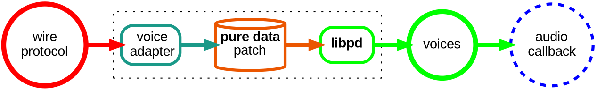

```graphviz
digraph g {
    rankdir=LR
    node [margin=0.07, fontname="Arial", fixedsize=false, penwidth=3];
    edge [penwidth=1.5];

    wp [label=<wire<br/>protocol>, shape=circle, color=red, penwidth=5];

    subgraph cluster_0 {
        style=dotted;
        va [label=< voice<br/> adapter>, shape=box, style=rounded, color="#1a9988"];
        pd [label=<<b>pure data</b><br/>patch>; shape=cylinder, color="#eb5600"];
        libpd [label=<<b>libpd</b>>, shape=box style=rounded, penwidth=3, color=green];
    }

    voices [label=<voices>, shape=circle, color=green, penwidth=5];
    audio [label=<audio<br/>callback>, shape=circle, style=dashed, color=blue];

    wp -> va [color=red, penwidth=4];
    va -> pd [penwidth=4, color="#1a9988"];
    pd -> libpd [penwidth=4, color="#eb5600"];
    
    //pd -> va [direction=none];

    libpd -> voices [penwidth=4, color=green];
    voices -> audio [penwidth=4, color=green];
}
```