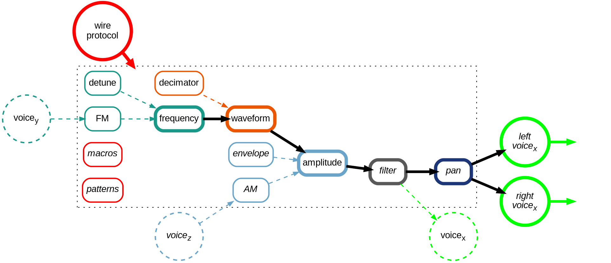

```graphviz
digraph {
    compound=true;
    graph [compound=true];
    rankdir=LR;
    
    node [margin=0.08 fontname="Arial", fixedsize=false, penwidth=2];
    edge [penwidth=1.5; arrowsize=.75; minlen=1.9];

    wp [label=<wire<br/>protocol>, shape=circle, penwidth=5, color=red];

    subgraph cluster_0 {
        style=dotted

        frequency [label=<frequency>      shape=box, style=rounded, color="#1a9988", penwidth=5];
        waveform  [label=<waveform>       shape=box, style=rounded, color="#eb5600", penwidth=5];
        amplitude [label=<amplitude>      shape=box, style=rounded, color="#6aa4c8", penwidth=5];
        filter    [label=<<i>filter</i>>, shape=box, style=rounded, color="#595959", penwidth=5];
        pan       [label=<<i>pan</i>>,    shape=box, style=rounded, color="#1c3678", penwidth=5]

        frequency -> waveform [penwidth=4];
        waveform -> amplitude [penwidth=4];
        amplitude -> filter [penwidth=4];
        filter -> pan [penwidth=4];


        sh [label=<decimator>, shape=box, style=rounded, color="#eb5600"];
        sh -> waveform [style=dashed, color="#eb5600"];

        dt [label=<detune>, shape=box, style=rounded, color="#1a9988"];
        dt -> frequency [style=dashed, color="#1a9988"];
        fm [label=<FM>, shape=box, style=rounded, color="#1a9988"]
        fm -> frequency [style=dashed, color="#1a9988"];

        envelope [label=<<i>envelope</i>>, shape=box, style=rounded, color="#6aa4c8"];
        envelope -> amplitude [style=dashed, color="#6aa4c8"];
        am [label=<<i>AM</i>>, shape=box, style=rounded, color="#6aa4c8"]
        am -> amplitude [style=dashed, color="#6aa4c8"];

        macros [label=<<i>macros</i>>, shape=box, style=rounded, color=red]
        patterns [label=<<i>patterns</i>>, shape=box, style=rounded, color=red]
    }

    voice [label=<voice<sub>x</sub>>, shape=circle, style=dashed, color=green];
    voicel [label=<<i>left<br/>voice<sub>x</sub></i>>, shape=circle, penwidth=5, color=green];
    voicer [label=<<i>right<br/>voice<sub>x</sub></i>>, shape=circle, penwidth=5, color=green];

    modf [label=<voice<sub>y</sub>>, style=dashed, shape=circle, color="#1a9988"];
    moda [label=<<i>voice<sub>z</sub></i>>, style=dashed, shape=circle, color="#6aa4c8"];
    outl [label=<>, shape=none];
    outr [label=<>, shape=none];

    wp -> frequency [lhead="cluster_0", penwidth=5, color=red];


    modf -> fm [style=dashed, color="#1a9988"];
    moda -> am [style=dashed, color="#6aa4c8"];
    filter -> voice [style=dashed, color=green];
    pan -> voicel [penwidth=4];
    pan -> voicer [penwidth=4];
    voicel -> outl [penwidth=4, color=green];
    voicer -> outr [penwidth=4, color=green];
}
```
