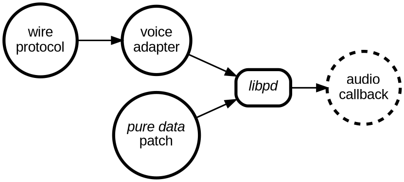

```pikchr
boxwid = .75
boxht = .2
boxrad = 0.05

right
WP0: circle "wire""protocol"
arrow
VA0: circle "voice""adapter"
down
line .25 from WP0.s invisible
PD0: circle "puredata""patch"

LP0: box "libpd" at (VA0.s,PD0.e)

right 
arrow

CB0: circle "audio""callback" dashed

arrow from WP0 to VA0 chop
arrow from PD0 to LP0 chop
arrow from VA0 to LP0 chop
```

