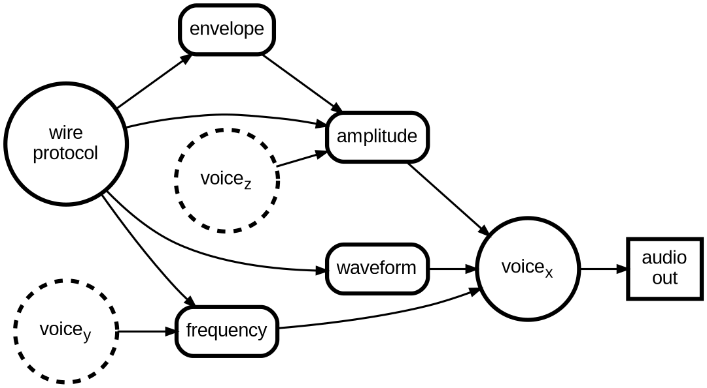

```graphviz
digraph g {
    rankdir=LR
    
    node [margin=0.1 fontname="Arial", fixedsize=false, penwidth=3]
    edge [penwidth=1.5; arrowsize=.75; minlen=1.99]
    
    wp [label=<wire<br/>protocol>, shape=circle]


    envelope [shape=box, style=rounded]
    waveform [shape=box, style=rounded]
    frequency [shape=box, style=rounded]
    amplitude [shape=box, style=rounded]

    
    voice [label=<voice<sub>x</sub>>, shape=circle]
    modf [label=<voice<sub>y</sub>>, style=dashed, shape=circle]
    moda [label=<voice<sub>z</sub>>, style=dashed, shape=circle]

    out [label=<audio<br/>out>, shape=box]

    voice -> out

    wp -> envelope -> amplitude
    wp -> amplitude -> voice
    wp -> waveform -> voice
    wp -> frequency -> voice
    modf -> frequency
    moda -> amplitude
}
```
