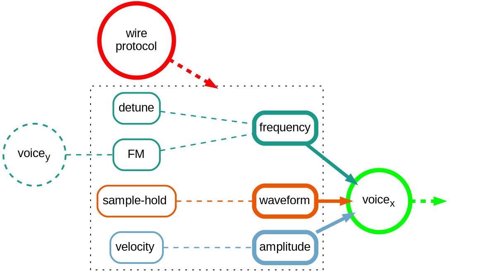

```graphviz
digraph {
    compound=true;
    graph [compound=true];
    rankdir=LR;
    node [margin=0.08 fontname="Arial", fixedsize=false, penwidth=2];
    edge [penwidth=1.5; arrowsize=.75; minlen=1.9];
    wp [label=<wire<br/>protocol>, shape=circle, penwidth=5, color=red];
    subgraph cluster_0 {
        style=dotted

        frequency [label=<frequency> shape=box, style=rounded, color="#1a9988", penwidth=5];
        waveform  [label=<waveform>  shape=box, style=rounded, color="#eb5600", penwidth=5];
        amplitude [label=<amplitude> shape=box, style=rounded, color="#6aa4c8", penwidth=5];
        
        vel [label=<velocity >, shape=box, style=rounded, color="#6aa4c8"];
        sh [label=<sample-hold >, shape=box, style=rounded, color="#eb5600"];
        sh -> waveform [style=dashed, color="#eb5600", dir=none];
        dt [label=<detune>, shape=box, style=rounded, color="#1a9988"];
        dt -> frequency [style=dashed, color="#1a9988", dir=none];
        fm [label="FM", shape=box, style=rounded, color="#1a9988"]
        fm -> frequency [style=dashed, color="#1a9988", dir=none];
        vel -> amplitude [style=dashed, color="#6aa4c8", dir=none];
    }
    voice [label=<voice<sub>x</sub>>, shape=circle, penwidth=5, color=green];
    modf [label=<voice<sub>y</sub>>, style=dashed, shape=circle, color="#1a9988"];
    out [label=<>, shape=none];
    wp -> frequency [lhead="cluster_0", penwidth=4, color=red, label="            ", style=dashed];
    modf -> fm [style=dashed, color="#1a9988", dir=none];
    amplitude -> voice [penwidth=4 color="#6aa4c8"];
    waveform -> voice [penwidth=4, color="#eb5600"];
    frequency -> voice [penwidth=4, color="#1a9988"];
    voice -> out [penwidth=4, color=green, style=dashed];
}
```
