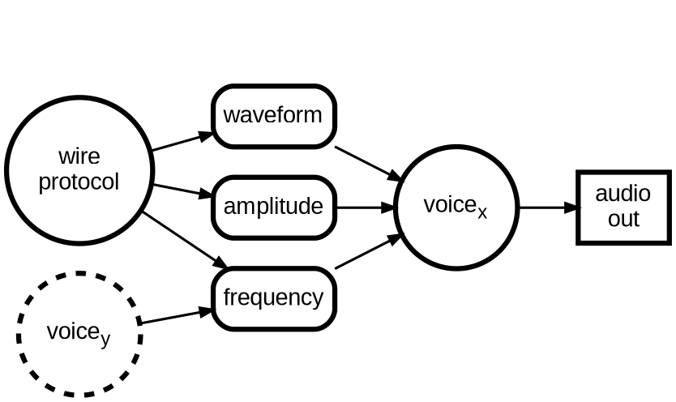

```graphviz
digraph g {
    rankdir=LR
    
    node [margin=0.08 fontname="Arial", fixedsize=false, penwidth=3]
    edge [penwidth=1.5; arrowsize=.75; minlen=1.99]

    wp [/* penwidth=6, */ label=<wire<br/>protocol>, shape=circle]

    waveform [label=<waveform> shape=box, style=rounded]
    frequency [label=<frequency> shape=box, style=rounded]
    amplitude [label=<amplitude> shape=box, style=rounded]

    voice [label=<voice<sub>x</sub>>, shape=circle]

    modf [label=<voice<sub>y</sub>>, style=dashed, shape=circle]

    out [label=<audio<br/>out>, shape=box]

    // yck [image="wheel.png"];

    wp -> amplitude -> voice
    wp -> waveform -> voice
    wp -> frequency -> voice

    modf -> frequency

    speaker [shape=none, label="", image="shape_custom.svg"]

    voice -> out
}
```
